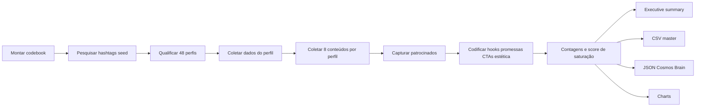
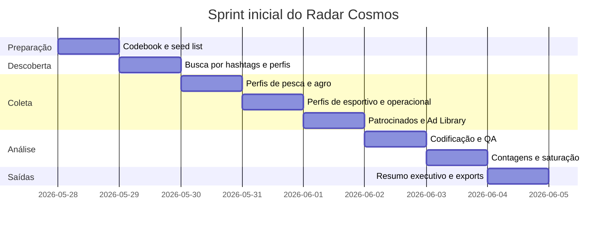

# Pesquisa inicial do radar Cosmos para fábricas de uniformes

## Resumo executivo

O primeiro sprint do radar deve ser **Instagram-first, orientado a Reels, hashtags, páginas comerciais e patrocinados**, porque a busca do Instagram permite explorar contas e termos, páginas de hashtag agregam fotos e vídeos públicos, o Explore recomenda conteúdo de contas que o usuário ainda não segue, e os anúncios podem aparecer em Feed, Stories, Explore e Reels. Além disso, a Meta mantém uma **Ad Library pesquisável** para anúncios ativos, o que torna o Instagram a melhor fonte primária para mapear aquisição, promessa comercial e linguagem criativa do nicho. citeturn1search1turn1search33turn1search21turn1search32turn1search30turn8search1turn8search37

A recomendação operacional para começar **imediatamente** é um sprint de **48 perfis** e **408 peças** de conteúdo: **12 perfis por segmento** nos quatro segmentos prioritários, **8 conteúdos por perfil** e **6 patrocinados por segmento**. O objetivo não é “achar perfis bonitos”, mas construir um **codebook proprietário** de posicionamento, promessa, hooks, CTA, estética, direção visual, prova técnica, saturação e lacunas acionáveis para Astro e para o ecossistema Cosmos. Como o Search & Explore do Instagram depende de critérios de elegibilidade e recomendação, o protocolo precisa salvar links, prints e data de coleta; a ausência de um post numa busca não deve ser lida como ausência de atividade competitiva. citeturn1search9turn1search21

## Objetivo e escopo

### Objetivo da primeira pesquisa

A primeira pesquisa deve responder, com evidência operacional:

1. **Como as fábricas líderes e emergentes de uniformes vendem percepção de valor no Instagram hoje.**
2. **Quais promessas, hooks, CTAs e estruturas de Reels estão dominando cada segmento.**
3. **Quais padrões já estão saturados e quais lacunas podem virar vantagem para Astro, Cosmos Midia, Cosmos Showroom, Cosmos Brain, Cosmos Design e Cosmos Ops.**

### Escopo da primeira varredura

O escopo inicial deve ser restrito a quatro segmentos, com conteúdo em **português** como prioridade:

| Segmento | Definição operacional | Pergunta central |
|---|---|---|
| **Pesca** | Camisas e uniformes personalizados para pesca esportiva, offshore, equipes, torneios e lifestyle | O nicho vende mais “performance técnica” ou “estilo/tribo”? |
| **Agro/comitiva** | Uniformes para fazenda, eventos, feiras, comitivas, rodeio, campo e equipe comercial agro | O valor está em identidade, resistência ou status visual? |
| **Esportivo** | Uniformes para times amadores, escolas, ligas, clubes e linhas personalizadas | O discurso dominante é performance, pertencimento ou customização? |
| **Operacional** | Uniformes industriais, logística, manutenção, postos, obra, serviços, PPE-adjacent | O nicho vende segurança, resistência, padronização ou rapidez? |

### O que fica fora deste sprint

Este sprint é de **inteligência de mercado**, não de criação. A leitura **frame a frame** de edição, iluminação, atuação, locução e estética profunda de criativos individuais pode ser melhor aprofundada no **chat de Análise de Perfil e Posts** ou no **chat de Análise de Locução**, depois que o radar identificar quais perfis e criativos merecem decupagem mais profunda.

## Fontes e amostragem

### Fontes prioritárias do Instagram

A ordem de prioridade deve ser esta:

| Prioridade | Fonte | Por que entra no sprint |
|---|---|---|
| Alta | **Reels** | Reels são desenhados para alcance e descoberta, inclusive fora da base de seguidores, e concentram linguagem criativa, áudio, texto de tela e CTA. citeturn1search32turn8search37 |
| Alta | **Hashtags** | Páginas de hashtag reúnem fotos e vídeos públicos e funcionam como porta de entrada para encontrar produtores e subnichos. citeturn1search33turn1search5 |
| Alta | **Páginas comerciais** | O perfil comercial consolida bio, posicionamento, provas, catálogo, contato, promessa e repetição estética. |
| Alta | **Patrocinados observados no app** | Mostram a mensagem que a marca decidiu pagar para escalar; são o melhor indicador de aquisição ativa. O Instagram permite ver “why you’re seeing this ad” em muitos anúncios. citeturn8search22turn8search10 |
| Alta | **Meta Ad Library** | Permite pesquisar anúncios ativos em produtos Meta e complementar a observação nativa de patrocinados. citeturn8search1turn1search30 |
| Média | **Conteúdos impulsionados** | Post, Story e Reel existentes podem ser impulsionados; vale marcar quando um criativo aparentemente orgânico foi transformado em mídia. citeturn8search23turn8search27 |

### Hashtags iniciais por segmento

A seed list inicial deve começar **exatamente** com as hashtags já definidas:

| Segmento | Hashtags seed |
|---|---|
| **Pesca** | `#camisetadepesca` `#uniformedepesca` `#pescaesportiva` `#camisapersonalizada` `#pescaoffshore` |
| **Agro/comitiva** | `#comitiva` `#modaagro` `#uniformeagro` `#camisaagro` `#agrobusiness` |
| **Esportivo** | `#uniformeesportivo` `#fardamentodefutebol` `#camisadetimes` `#uniformepersonalizado` |
| **Operacional** | `#uniformeprofissional` `#uniformeoperacional` `#epi` `#uniformeindustrial` |

### Regra de amostragem recomendada

Amostra recomendada para a **primeira onda**:

| Unidade | Regra |
|---|---|
| **Perfis por segmento** | **12** |
| **Perfis totais** | **48** |
| **Composição por segmento** | 4 líderes, 4 especialistas puros, 4 challengers emergentes |
| **Conteúdos por perfil** | **8** peças |
| **Patrocinados por segmento** | **6** |
| **Total de conteúdos orgânicos** | **384** |
| **Total de patrocinados** | **24** |
| **Total do corpus** | **408** itens |

### Regra de seleção de perfil

Um perfil entra na amostra se cumprir pelo menos **quatro** critérios:

- vende uniforme, linha própria, personalização ou fabricação;
- usa português na maior parte da comunicação;
- tem perfil público;
- tem atividade recente;
- mostra intenção comercial clara em bio, link, WhatsApp, orçamento ou copy;
- publica Reels, posts ou anúncios com foco em produto/cliente/segmento.

### Janela de recência

Use três janelas:

| Janela | Uso |
|---|---|
| **90 dias** | leitura principal de dinâmica comercial recente |
| **180 dias** | corpus padrão do sprint |
| **365 dias** | fallback para perfil com pouca atividade ou para captar conteúdo fixado/mais emblemático |

### Regra de coleta por fonte

1. **Hashtags:** olhar os **20 primeiros resultados** por hashtag; salvar perfis comerciais elegíveis.
2. **Busca/Explore:** pesquisar o termo da hashtag sem `#` e abrir contas relevantes adicionais. O Search & Explore existe justamente para buscar “quem” e “o quê”, e o Explore recomenda conteúdo de contas não seguidas. citeturn1search1turn1search21
3. **Perfil comercial:** coletar dados do perfil e os **6 Reels mais recentes** + **2 conteúdos fixados ou estratégicos**.
4. **Patrocinados nativos:** usar **2 contas-teste limpas** e sessões de 15–20 minutos por segmento; registrar criativos marcados como patrocinados.
5. **Ad Library:** pesquisar o nome das marcas amostradas e palavras-chave do nicho; salvar os **4 anúncios ativos mais representativos por segmento**. citeturn8search1

### Fonte avançada opcional

Se houver parceria elegível de pesquisa, a **Meta Content Library** é uma camada avançada útil para uma fase posterior, porque oferece acesso a conteúdo público de Facebook e Instagram, com busca, filtros, multimídia, dashboards e exportação, mas a entrada depende de **elegibilidade e aprovação**; a própria Meta informa que não há taxa de acesso, porém exige afiliação de pesquisa ou interesse público para elegibilidade. Para o sprint imediato, portanto, ela é **opcional e não crítica**. citeturn3view6

## Coleta e documentação

### Passo a passo operacional

**Passo um.** Criar o **codebook mestre** em Airtable, Notion ou Sheets com duas bases: `perfis` e `conteudos`.

**Passo dois.** Abrir uma planilha “seed discovery” com as 18 hashtags iniciais e as colunas: hashtag, perfil encontrado, segmento, subsegmento, elegível?, motivo.

**Passo três.** Para cada hashtag, revisar os 20 primeiros resultados e salvar apenas perfis com intenção comercial.

**Passo quatro.** Deduplicar perfis e fechar a amostra de 12 por segmento.

**Passo cinco.** Coletar o bloco de **perfil**: bio, promessa, contato, provas, volume de posts, seguidores, geografia visível, tipo de oferta.

**Passo seis.** Coletar os **8 conteúdos** por perfil com captura de link, print, texto do post, data, formato e codificação criativa.

**Passo sete.** Rodar a coleta de **patrocinados** no app e na Ad Library. Quando disponível, registrar também o texto de “why you’re seeing this ad”; isso ajuda a entender o contexto de entrega do anúncio. citeturn8search22turn8search1

**Passo oito.** Codificar os conteúdos com foco em: promessa, prova, hook, CTA, tom emocional, estética, movimento visual e oferta.

**Passo nove.** Rodar uma **calibração entre codificadores** em uma amostra-piloto e revisar divergências. Em análise qualitativa, checagens de concordância ajudam a aumentar sistematicidade, comunicabilidade e transparência do processo de codificação. citeturn3view9

**Passo dez.** Consolidar contagens, score de saturação e oportunidades.

### Campos obrigatórios de coleta

As métricas de performance e conteúdo em contas próprias podem ser complementadas por **Insights**, que o Instagram descreve como fonte de estatísticas como engajamento, interações e impressões. Para concorrentes, use o que estiver **visível publicamente** no momento da coleta e diferencie claramente “métrica pública” de “insight proprietário”. citeturn9search0turn9search1turn9search4turn9search9turn9search11

#### Tabela de perfil

| Campo | Tipo | Exemplo de preenchimento |
|---|---|---|
| `perfil_handle` | texto | `@uniformesalternativa` |
| `nome_perfil` | texto | Alternativa Uniformes |
| `segmento_primario` | enum | agro/comitiva |
| `segmento_secundario` | enum | feiras/eventos |
| `idioma` | enum | pt-BR |
| `localizacao_visivel` | texto | Sarandi, RS |
| `seguidores_visiveis` | texto/num | 11K |
| `posts_visiveis` | num | 260 |
| `bio_claim` | texto | “identidade, estilo e pertencimento” |
| `contato_visivel` | texto | link na bio / WhatsApp / DM |
| `posicionamento_macro` | enum | premium técnico / popular / industrial / institucional |
| `promessa_dominante` | texto | alto padrão para representar a marca |
| `prova_dominante` | texto | tecido, modelagem, bordado, funcionalidade |
| `cta_dominante` | texto | orçamento / WhatsApp / link da bio |
| `fabricacao_propria_sinal` | sim/não | sim / não / não verificável |
| `envio_nacional_sinal` | sim/não | sim |
| `observacoes` | texto | foco claro em feiras agro |

#### Tabela de conteúdo

| Campo | Tipo | Exemplo de preenchimento |
|---|---|---|
| `content_id` | texto | URL ou ID do post |
| `perfil_handle` | texto | `@usesuperbolla` |
| `data_publicacao` | data | 2026-05-10 |
| `formato` | enum | reel / post / carrossel / anúncio |
| `surface_source` | enum | hashtag / reels / perfil / patrocinado / ad_library |
| `segmento` | enum | pesca |
| `subsegmento` | texto | equipe de pesca |
| `patrocinado` | sim/não | sim |
| `copy_caption` | texto | texto integral ou resumo fiel |
| `hook_abertura` | texto | “escolha cada detalhe do seu uniforme” |
| `promessa` | texto | personalização + UV + conforto |
| `prova` | texto | tecido leve, proteção UV, escudo, nome, arte |
| `cta` | texto | siga / compre / peça orçamento |
| `tom_emocional` | enum | premium / técnico / aspiracional / utilitário |
| `estetica` | enum | outdoor / estúdio / fábrica / evento / lifestyle |
| `direcao_visual` | texto | close de tecido, mockup, time em campo, produto flat |
| `estrutura_reel` | texto | hook → prova → personalização → CTA |
| `audio_tipo` | enum | música trend / original / locução / sem áudio claro |
| `texto_tela` | texto | transcrição resumida |
| `palavra_chave_claim` | texto | UV50+, dry fit, alto padrão |
| `métrica_views_visivel` | num | 12500 |
| `métrica_likes_visivel` | num | 430 |
| `métrica_comments_visivel` | num | 18 |
| `engajamento_proxy` | fórmula | `(likes+comments)/seguidores` |
| `premium_cues` | texto | zíper, patch 3D, acabamento premium |
| `offer_cues` | texto | desconto, pronta-entrega, pedido mínimo |
| `sinal_diferencial` | texto | simulador, feira agro, customização total |
| `saturacao_tag` | enum | baixa / média / alta |
| `observacoes` | texto | precisa validação de áudio no app |

### Template JSON de documentação

```json
{
  "type": "profile_content_audit",
  "collection_date": "YYYY-MM-DD",
  "profile": {
    "perfil_handle": "@exemplo",
    "nome_perfil": "Nome da Marca",
    "segmento_primario": "pesca",
    "segmento_secundario": "equipe de pesca",
    "idioma": "pt-BR",
    "localizacao_visivel": "",
    "seguidores_visiveis": "",
    "posts_visiveis": "",
    "bio_claim": "",
    "contato_visivel": "",
    "posicionamento_macro": "",
    "promessa_dominante": "",
    "prova_dominante": "",
    "cta_dominante": "",
    "fabricacao_propria_sinal": "",
    "envio_nacional_sinal": "",
    "observacoes": ""
  },
  "content_items": [
    {
      "content_id": "",
      "data_publicacao": "",
      "formato": "reel",
      "surface_source": "perfil",
      "segmento": "pesca",
      "subsegmento": "",
      "patrocinado": false,
      "copy_caption": "",
      "hook_abertura": "",
      "promessa": "",
      "prova": "",
      "cta": "",
      "tom_emocional": "",
      "estetica": "",
      "direcao_visual": "",
      "estrutura_reel": "",
      "audio_tipo": "",
      "texto_tela": "",
      "palavra_chave_claim": [],
      "metrica_views_visivel": null,
      "metrica_likes_visivel": null,
      "metrica_comments_visivel": null,
      "engajamento_proxy": null,
      "premium_cues": [],
      "offer_cues": [],
      "sinal_diferencial": "",
      "saturacao_tag": "",
      "observacoes": ""
    }
  ],
  "status": "draft"
}
```

### Template tabular mínimo

| coleta_data | perfil_handle | segmento | formato | source | patrocinado | hook | promessa | prova | CTA | tom | estética | direção_visual | áudio | views | likes | comments | saturacao_tag | oportunidade |
|---|---|---|---|---|---|---|---|---|---|---|---|---|---|---:|---:|---:|---|---|

## Método analítico

A base deve ser tratada como um projeto de **content analysis** combinado com **thematic analysis**. Em content analysis, a ideia é codificar de modo sistemático palavras, temas e conceitos para depois quantificar presença, significado e relações; em thematic analysis, o fluxo recomendado passa por familiarização com o dataset, codificação, geração de temas, revisão, refinamento e redação analítica. citeturn3view7turn3view8

### Análise qualitativa

Use seis movimentos:

1. **Familiarização:** ver o corpus inteiro por segmento.
2. **Codificação aberta:** marcar hooks, promessas, provas, CTA, estética, áudio, tom.
3. **Agrupamento temático:** unir códigos em temas como “prova técnica”, “pertencimento”, “customização radical”, “baixo preço”, “urgência”.
4. **Revisão por segmento:** identificar o que muda entre pesca, agro, esportivo e operacional.
5. **Refino:** nomear os temas finais com linguagem útil ao Cosmos Brain.
6. **Síntese executiva:** transformar tema em decisão, risco ou oportunidade. citeturn3view8

### Análise quantitativa

Rode quatro famílias de contagem:

| Medida | Como calcular | Uso |
|---|---|---|
| **Frequência absoluta** | nº de vezes que um hook/promessa aparece | achar padrão dominante |
| **Frequência por segmento** | nº de ocorrências dentro do segmento | achar diferença setorial |
| **Frequência por surface** | perfil vs reels vs patrocinado | separar branding de aquisição |
| **Mediana de engajamento proxy** | mediana de `(likes+comments)/followers` quando possível | priorizar padrões com reação visível |

### Score de saturação

Use um score simples, de **0 a 20**, por padrão:

| Componente | Escala |
|---|---|
| Frequência total no corpus | 0–5 |
| Presença em quantos segmentos | 0–5 |
| Repetição dentro do mesmo perfil | 0–5 |
| Presença em patrocinados | 0–5 |

**Leitura do score**

- **0–5:** baixa saturação
- **6–10:** moderada
- **11–15:** alta
- **16–20:** saturada

### Critério de dominância

Um padrão só deve ser chamado de **dominante** quando cumprir os três pontos abaixo ao mesmo tempo:

- aparece com frequência alta;
- cruza mais de um segmento;
- também aparece em patrocinados ou em conteúdos comerciais claramente orientados a conversão.

### Qualidade do processo

A literatura sobre codificação qualitativa recomenda checagens de concordância entre codificadores porque elas aumentam sistematicidade, transparência e confiabilidade percebida do processo. Na prática, faça uma **rodada-piloto dupla** antes de codificar o corpus inteiro. citeturn3view9

## Entregáveis, cronograma e recursos

### Saídas obrigatórias do sprint

Ao final da primeira onda, o pesquisador deve entregar:

| Entregável | Formato | Conteúdo obrigatório |
|---|---|---|
| **Executive summary** | PDF/Markdown | visão geral, segmento dominante, promessa dominante, linguagem dominante, saturação e oportunidades |
| **Base master** | CSV | uma linha por conteúdo e uma linha por perfil |
| **Top 10 patterns** | tabela + gráfico | hooks, promessas, provas, CTA e estética mais recorrentes |
| **Mapa de saturação** | heatmap | padrão x segmento |
| **5 oportunidades para Astro/Cosmos** | blocos estratégicos | cada uma com Impacto Estratégico Detectado |
| **Export Cosmos Brain** | JSON | sinais estruturados prontos para ingestão |
| **Charts visuais** | PNG/SVG | barras, heatmap, scatter, ranking |

### Top dez padrões para monitorar desde o dia zero

Um scan público preliminar de contas e snippets em português já mostra um vocabulário competitivo fortemente concentrado em **proteção UV**, **tecido leve/respirável**, **personalização de nome/logo/arte**, **identidade/pertencimento**, **alto padrão para feiras e eventos**, **acabamento premium**, **performance/resistência**, **prova de escala ou tradição**, **simulador/monte seu uniforme** e **orçamento/contato direto**. Esses sinais aparecem com força em contas como Alternativa Uniformes, Super Bolla e outros perfis públicos do nicho. citeturn7search11turn7search6turn7search14turn7search20turn11search0turn7search5turn11search25turn0search32

### Oportunidades prioritárias para Astro e Cosmos

#### Impacto Estratégico Detectado

**Aplicação potencial**  
Astro, Cosmos Showroom, Cosmos Brain

**Tipo de oportunidade**  
feature, workflow, UX

**Potencial estratégico**  
extremamente estratégico

**Explicação**  
Há um sinal forte de mercado para **customização guiada**: a Super Bolla usa linguagem de “escolha cada detalhe”, “linha completa totalmente personalizável” e até comunica um **simulador** e compra 100% online. Isso sugere oportunidade clara para um **showroom/configurador segmentado por nicho**, com presets de pesca, agro, esportivo e operacional. citeturn7search5turn7search7turn11search25turn11search0

#### Impacto Estratégico Detectado

**Aplicação potencial**  
Astro, Cosmos Midia, Cosmos Design

**Tipo de oportunidade**  
branding, direção criativa

**Potencial estratégico**  
alto

**Explicação**  
No agro/comitiva, a comunicação pública de Alternativa Uniformes gira em torno de **identidade, estilo, pertencimento, alto padrão, tecidos, modelagem, bordados e funcionalidade** para feiras e eventos. Isso abre espaço para Astro construir uma linguagem premium de **“marca vestível em contexto de negócios”**, e não apenas de produto. citeturn7search11turn6search3turn6search5turn7search14

#### Impacto Estratégico Detectado

**Aplicação potencial**  
Cosmos Brain, Astro, Cosmos Midia

**Tipo de oportunidade**  
automação, feature

**Potencial estratégico**  
alto

**Explicação**  
Como a Meta oferece uma biblioteca pesquisável de anúncios ativos e o Instagram permite impulsionar posts, reels e stories existentes, há espaço para uma camada de **inteligência de patrocinados**: biblioteca própria de hooks pagos, claims pagos e CTAs pagos por segmento. Isso ajuda Astro a entender não só o que o mercado publica, mas o que ele **escala com mídia**. citeturn8search1turn8search23turn8search27turn1search30

#### Impacto Estratégico Detectado

**Aplicação potencial**  
Cosmos Midia, Cosmos Design, Cosmos Showroom

**Tipo de oportunidade**  
branding, direção criativa, workflow

**Potencial estratégico**  
alto

**Explicação**  
Os snippets públicos de pesca, agro e operacional mostram muita ênfase em prova técnica como **UV**, **dry fit**, **respirabilidade**, **resistência**, **segurança** e **faixa refletiva**. A oportunidade para Astro é empacotar isso em um sistema criativo onde cada segmento recebe uma “prova técnica cinematográfica” própria, sem cair no mesmo layout saturado do nicho. citeturn7search5turn6search14turn6search17turn0search32

#### Impacto Estratégico Detectado

**Aplicação potencial**  
Cosmos Ops, Cosmos Brain, Astro

**Tipo de oportunidade**  
automação, workflow

**Potencial estratégico**  
médio-alto

**Explicação**  
O corpus inicial sugere que a jornada comercial do nicho é fragmentada entre bio, direct, orçamento e contato informal. Há espaço para um workflow Cosmos Ops com **triagem por segmento**, **briefing estruturado**, **biblioteca de claims** e **playbooks de atendimento** alimentados pelos padrões dominantes detectados na pesquisa. Esse ganho não é apenas criativo; é operacional. citeturn7search11turn11search0turn8search22turn9search0

### Recursos e tempo

#### Tempo por perfil

| Etapa | Tempo médio |
|---|---:|
| Qualificação do perfil | 5 min |
| Coleta do bloco de perfil | 7 min |
| Codificação de 8 conteúdos | 16 min |
| Revisão e observações | 4 min |
| **Total por perfil** | **32 min** |

#### Carga total recomendada

| Bloco | Volume | Tempo estimado |
|---|---:|---:|
| Perfis | 48 | 25h36 |
| Patrocinados | 24 | 2h00 |
| Calibração e QA | — | 3h00 |
| Contagens e análises | — | 4h00 |
| Redação executiva + export | — | 4h00 |
| **Total** | — | **38h36** |

#### Estrutura de time

| Modelo | Papéis |
|---|---|
| **Mínimo viável** | 1 Senior Market Intelligence Researcher |
| **Ideal** | 1 Lead de Inteligência + 2 codificadores/pesquisadores + 1 apoio de dados/ops |

#### Ferramentas

| Função | Ferramenta sugerida |
|---|---|
| Navegação e captura | Instagram app + desktop |
| Anúncios | Meta Ad Library |
| Base estruturada | Airtable, Notion ou Google Sheets |
| Evidência visual | captura de tela, Loom ou similar |
| Consolidação quantitativa | Sheets, Excel, Python ou R |
| Visualização | Looker Studio, Datawrapper ou Sheets charts |

### Workflow em Mermaid



### Timeline em Mermaid



### Formatos de exportação

Os três formatos de saída devem ser padronizados assim:

- **CSV master:** uma linha por conteúdo, pronto para pivot e dashboard.
- **JSON para Cosmos Brain:** um objeto por sinal, perfil ou pattern.
- **Charts visuais:** barras de frequência, heatmap por segmento, scatter de engajamento proxy, matriz de saturação.

## Exemplos preenchidos

Os exemplos abaixo são **demonstrativos**, preenchidos a partir de snippets públicos indexados do Instagram e servem para treinar o time no padrão de registro. Campos de áudio, edição fina e detalhes visuais devem ser confirmados no player nativo durante a coleta. citeturn7search11turn6search3turn11search0turn7search5

### Exemplo de bloco de perfil

No caso de **@uniformesalternativa**, o perfil público indexado mostra **11 mil seguidores e 260 posts**, com bio centrada em “identidade, estilo e pertencimento”. Os snippets públicos associados ao perfil reforçam **feiras e eventos do agro**, “alto padrão” e atenção a **tecidos, modelagem, bordados, funcionalidade e identidade visual**. citeturn7search11turn6search3turn6search5turn7search14

| Campo | Valor preenchido |
|---|---|
| perfil | `@uniformesalternativa` |
| segmento | agro/comitiva |
| subsegmento | feiras e eventos agro |
| posicionamento | premium institucional |
| promessa dominante | uniforme como extensão da marca e do estande |
| hooks observados | “fortaleça sua marca”, “alto padrão”, “uniforme para feira não é detalhe” |
| CTA dominante | orçamento/link da bio/atendimento comercial |
| estética | institucional premium |
| direção visual | foco provável em equipe, aplicação de marca, acabamento e contexto de evento |
| estrutura do reel | problema comercial → prova de alto padrão → marca/equipe → CTA |
| música/locução | a validar no player nativo |
| copy | “Uniformes para feiras e eventos do agro exigem atenção aos detalhes” |
| métricas visuais | 11K seguidores, 260 posts |
| engajamento público | a coletar no app no momento da amostragem |
| patrocinado? | não visível no snippet |
| linguagem dominante | identidade, pertencimento, alto padrão, detalhe |
| saturação percebida | média-alta no recorte de feira/evento |
| diferencial competitivo observado | converte uniforme em ativo de representação comercial |
| observação de oportunidade | forte candidata para benchmark de agro premium B2B |

### Exemplo de bloco de perfil

No caso de **@usesuperbolla**, o perfil público indexado mostra **5K+ seguidores, 93 seguindo e 365 posts**, com promessa de “monte o seu uniforme”. Os snippets públicos da linha de pesca destacam **personalização total**, **proteção UV**, **tecido leve**, **arte exclusiva**, e a marca também comunica **simulador** e compra online em outro reel público indexado. citeturn11search0turn7search5turn7search7turn11search25

| Campo | Valor preenchido |
|---|---|
| perfil | `@usesuperbolla` |
| segmento | pesca |
| subsegmento | equipes e personalizados |
| posicionamento | técnico-premium com viés de customização |
| promessa dominante | escolha cada detalhe e leve a paixão pela pesca para outro nível |
| hooks observados | “monte o seu uniforme”, “escolha cada detalhe”, “linha completa totalmente personalizável” |
| CTA dominante | seguir/comprar/orçar pelo ecossistema da marca |
| estética | produto-performance |
| direção visual | foco provável em detalhes técnicos, mockup/aplicações, equipe e uso esportivo |
| estrutura do reel | hook de personalização → prova técnica → exclusividade → CTA |
| música/locução | a validar no player nativo |
| copy | “Personalizamos com nome, logo, apelido e arte exclusiva da sua equipe” |
| métricas visuais | 5K+ seguidores, 365 posts |
| engajamento público | a coletar no app no momento da amostragem |
| patrocinado? | não visível no snippet |
| linguagem dominante | customização, performance, UV, conforto, exclusividade |
| saturação percebida | alta no recorte “personalização + prova técnica” |
| diferencial competitivo observado | ponte entre produto personalizado e simulador digital |
| observação de oportunidade | excelente benchmark para showroom/configurador Cosmos |

## Formato para Cosmos Brain

Este sinal JSON abaixo resume a lógica da primeira pesquisa e já está em formato utilizável pelo Cosmos Brain.

```json
{
  "type": "market_signal",
  "segmento": "pesca",
  "hook_type": "customizacao_total",
  "tom_emocional": "tecnico_premium",
  "objetivo_comercial": "gerar_orcamento_e_simulacao",
  "insight": "Perfis de uniformes para pesca e personalizados em português repetem a combinação personalização + prova técnica, com claims como proteção UV, tecido leve, arte exclusiva e escolha de detalhes.",
  "oportunidade": "Construir no Cosmos Showroom um configurador visual por segmento com presets de pesca, reforçando exclusividade e reduzindo fricção comercial.",
  "evidencia_resumida": [
    "uso recorrente de linguagem de personalização total",
    "presença de prova técnica como conforto e proteção UV",
    "presença de simulador e compra online em benchmark público"
  ],
  "aplicacao_potencial": [
    "Astro",
    "Cosmos Showroom",
    "Cosmos Brain"
  ],
  "status": "draft"
}
```